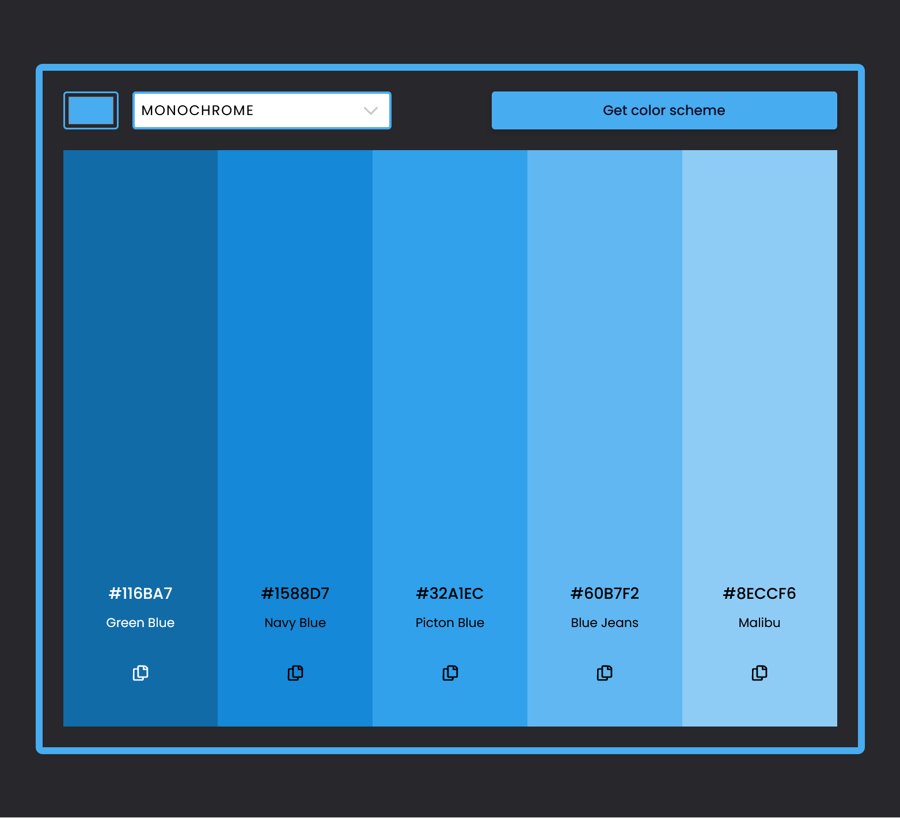
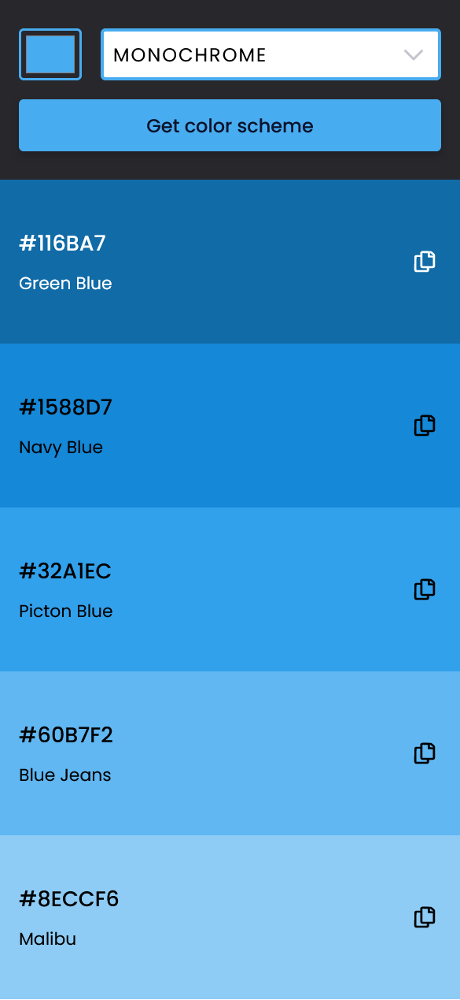

# Color Scheme Generator - A Scrimba FEWD Project

This is my solution to the Color Scheme Generator solo project, a module 9 project from the Scrimba Frontend Developer Career Path.

A minimilist color palette generator that uses the browser's built-in color picker and [The Color API](https://www.thecolorapi.com/) to generate a scheme of 5 colors, according to the user selected color harmony mode.

## Table of contents

- [Overview](#overview)
  - [Project requirements](#project-requirements)
  - [Screenshot](#screenshot)
  - [Links](#links)
- [My process](#my-process)
  - [Built with](#built-with)
  - [What I learned](#what-i-learned)
  - [Useful resources](#useful-resources)
- [Author](#author)

## Overview

### Project requirements 

Users should be able to:

- Choose "seed color" using the browser's built-in color picker
- Chose a color scheme mode using a select drop-down input
- Click on the "Get color scheme" button to generate a color scheme
- See 5 colors and their associated hex codes based on the selected scheme

Project stretch goal:
- Allow user to click on hex code to copy to clipboard

Personal enhancements:
- Mobile first design with specific layouts for mobile and desktop
- Added accessibility enhancements, allowing for keyboard input to copy color codes
- Dynamic contrast color for Color result bar metadata (hex code, color name) and copy icon

### Screenshot





### Links

- [Scrimba Scrim](https://your-solution-url.com)
- [Live Site](https://color-scheme-generator-mattpahuta.vercel.app/)

## My process

### Built with 

- Semantic HTML5 markup
- Flexbox
- CSS Grid
- CSS custom properties
- Vanilla JavaScript
- REST API: [The Color API](https://www.thecolorapi.com/)

### What I learned

For perhaps the first time, I used the [URLSearchParams interface](https://developer.mozilla.org/en-US/docs/Web/API/URLSearchParams) within the async function to fetch the desired results from the API. While not necessarily streamlining the code, it may enhance the clarity of the fetch request.

```js
  // build params object
  const params = {
    hex: seedColor,
    mode: colorMode
  };
  // build query string for use in API call
  const queryString = new URLSearchParams(params).toString();
  const url = `https://www.thecolorapi.com/scheme?${queryString}`;
```

I've used data attributes for other projects in the past, but this is the first time, I believe, I've used them with the .closest method. Getting the syntax exactly right took a bit of trial and error.

```js
function copyHex(e) {
  const hexValue = e.target.closest('[data-hex]').dataset.hex;
  // hanle keyboard and mouse click commands for copy feature
  if (e.key === 'Enter' || e.type === 'click') {
    navigator.clipboard.writeText(hexValue);
    const copyDialog = document.querySelector('#copy-dialog');
        copyDialog.textContent = `${hexValue} copied.`;
        copyDialog.show();
        setTimeout(() => {
          copyDialog.close();
        }, 1500)
  }
}
```

### Useful resources

- [The Color API Docs](https://www.thecolorapi.com/docs) - A simple yet robust API. Easy to get started and a joy to work with.
- [Modern CSS Solutions](https://moderncss.dev/custom-css-styles-for-form-inputs-and-textareas/) - An amazing resource from Stephanie Eckles I keep coming back to.

## Author

- Website - [Matt Pahuta](https://www.mattpahuta.com)
- LinkedIn - [Matt Pahuta](www.linkedin.com/in/mattpahuta)